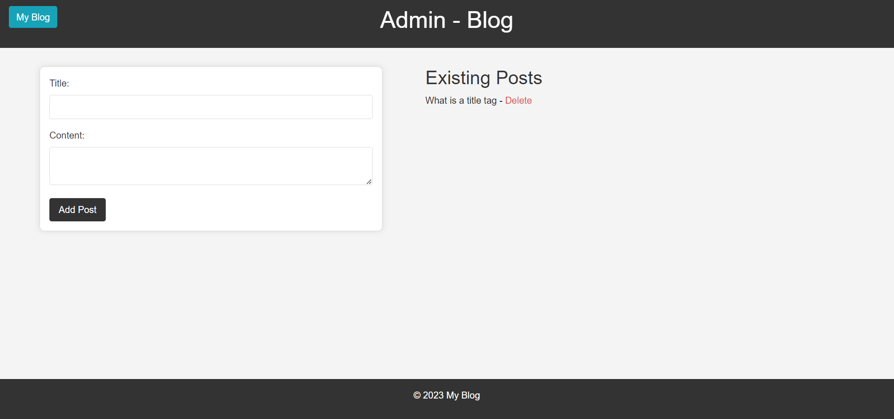

# Simple Blog Platform

This is a simple personal blog platform where users can read posts, and the admin can add or delete posts.

## Prerequisites

- Python (version 3.10.0)
- Flask (version 3.0.0)
- SQLite database

## Getting Started
1. Clone the repository:

    ```bash
    https://github.com/amitraghatate/ZedblockProject.git
    ```

2. Navigate to the project directory:

    ```
    cd F:\ZedBlockIntern
    ```

3. Create a virtual environment:

    ```
    python -m venv venv
    ```

4. Activate the virtual environment:

     ```
     venv\Scripts\activate
     ```

5. Install dependencies:

    ```
    pip install -r requirements.txt
    ```

6. Initialize the database:

    ```
    python app.py initdb
    ```

7. Run the application:

    ```
    python app.py
    ```

    The application will be accessible at http://127.0.0.1:5000/.
## Preview Images
1. Home page without Values
   
2. Admin page without values
   
3. Home Page
   
4. Admin Page
   
5. Blog Page
   


## Usage

- Visit the homepage to read blog posts.
- Access the admin page at http://127.0.0.1:5000/admin to add or delete posts.

## Contributing

1. Fork the repository.
2. Create a new branch: `git checkout -b feature-name`.
3. Commit your changes: `git commit -m 'Add new feature'`.
4. Push to the branch: `git push origin feature-name`.
5. Submit a pull request.
